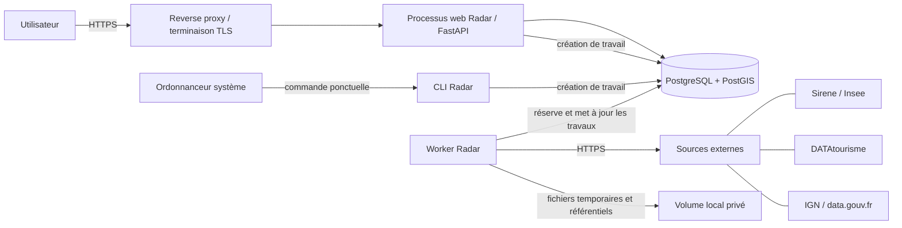

# Radar — Architecture technique

> Statut : cadrage technique du MVP
>
> Dernière mise à jour : 3 septembre 2026
>
> Périmètre : monolithe modulaire déployé sur un serveur privé

## 1. Objet du document

Ce document décrit l'architecture technique retenue pour construire et
exploiter le MVP de Radar. Il précise les composants, leurs responsabilités,
leurs dépendances, les flux principaux et les garanties attendues en matière
de sécurité et de fiabilité.

Il complète :

- `docs/product.md`, référence pour le besoin et les invariants produit ;
- `docs/data-sources.md`, référence pour les contrats avec les fournisseurs ;
- `docs/database.md`, référence pour le schéma persistant et ses contraintes ;
- `docs/scoring.md`, référence pour les règles de calcul des scores ;
- `docs/roadmap.md`, référence pour l'ordre de réalisation.

L'architecture ne doit pas anticiper des besoins absents du MVP. Elle pourra
évoluer lorsque les mesures réelles le justifieront, mais sans transformer les
frontières fonctionnelles définies ici de manière implicite.

## 2. Contraintes et décisions structurantes

### 2.1 Contraintes

- Un seul utilisateur et un seul food truck.
- Une application privée, mais accessible depuis Internet.
- Une zone de collecte limitée à 50 km autour d'une adresse de France
  métropolitaine.
- Des recherches locales rapides qui ne contactent aucun fournisseur externe.
- Deux collectes de nature différente : Sirene, mensuelle, et DATAtourisme,
  nocturne.
- Des traitements Sirene potentiellement longs et un fichier géographique
  d'environ 772 Mo dans la décision produit actuelle.
- La conservation des corrections, notes, masquages et provenances malgré les
  synchronisations.
- PostgreSQL non exposé sur Internet.
- Une reprise fiable après une interruption ou une indisponibilité fournisseur.

### 2.2 Décisions retenues pour le MVP

1. Radar est un **monolithe modulaire** : un seul dépôt, un seul modèle métier
   et une seule base de données.
2. Le backend utilise Python, FastAPI, Pydantic, SQLAlchemy, Alembic et `httpx`.
3. PostgreSQL avec PostGIS constitue l'unique stockage persistant métier et la
   file de travaux durables.
4. Le serveur web et le worker sont deux processus du même logiciel et de la
   même version. Cette séparation de processus protège les requêtes web des
   collectes longues ; elle ne crée pas un microservice.
5. Un ordonnanceur du système d'exploitation déclenche les échéances. Radar
   n'introduit ni Celery, ni Redis, ni RabbitMQ, ni service d'ordonnancement
   distribué dans le MVP.
6. Les collectes sont asynchrones du point de vue HTTP : une action manuelle
   crée un travail durable puis retourne immédiatement son identifiant.
7. L'interface et l'API partagent la même origine Internet. L'authentification
   utilise une session opaque conservée côté serveur, pas un JWT stocké dans
   le navigateur.
8. La distance est calculée par PostGIS à partir des positions conservées ;
   elle n'est pas stockée comme propriété intrinsèque d'une fiche.
9. Les adaptateurs externes produisent des observations normalisées et ne
   manipulent jamais les modèles SQLAlchemy.
10. Les valeurs externes, les corrections utilisateur et les valeurs métier
    effectives restent séparées.

### 2.3 Éléments explicitement non retenus

Le MVP n'a besoin ni de microservices, ni de Kubernetes, ni de bus de
messages, ni de cache distribué, ni de moteur de recherche séparé, ni de
stockage objet. Il n'introduit pas non plus de serveur dédié à l'intelligence
artificielle, de crawler web ou de pipeline généraliste de données.

Ces composants ne devront être envisagés que si une limite mesurée ne peut pas
être résolue simplement dans le monolithe.

## 3. Vue d'ensemble



En production, seuls les ports HTTP et HTTPS du reverse proxy sont publics.
Le processus web, le worker et PostgreSQL communiquent sur une interface
locale ou un réseau privé du serveur. Le volume local n'est accessible ni au
navigateur ni directement depuis Internet.

## 4. Organisation du monolithe

### 4.1 Modules fonctionnels

Le code doit être organisé autour des responsabilités suivantes. Les noms de
paquets exacts pourront être ajustés lors de l'initialisation du projet, mais
les frontières restent celles-ci.

| Module | Responsabilité principale |
| --- | --- |
| `auth` | Compte unique, mot de passe, sessions et changement administratif du mot de passe |
| `settings` | Adresse de référence, position confirmée, rayon de collecte et réglages internes |
| `prospects` | Fiches de prospects, états administratifs, contacts, corrections, notes et masquage |
| `events` | Fiches d'événements, occurrences, organisateurs, contacts, corrections, notes et masquage |
| `search` | Listes, filtres, tris, recherche textuelle, distances et état de couverture |
| `scoring` | Règles déterministes, version des règles et explications du score |
| `collections` | Travaux durables, cycles, orchestration, complétude, reprises et couverture publiée |
| `providers` | Adaptateurs Sirene, DATAtourisme, Géoplateforme et référentiels téléchargés |
| `provenance` | Observations sources, fraîcheur, valeurs externes et règles de conformité |
| `persistence` | Sessions SQLAlchemy, dépôts concrets, transactions et requêtes PostGIS |
| `web` | Routes FastAPI, schémas HTTP, cookies, CSRF et traduction des erreurs |
| `worker` | Réservation et exécution des travaux de fond |
| `cli` | Création initiale du compte, remplacement administratif du mot de passe et déclenchements système |

Cette liste ne signifie pas qu'il faut créer une interface et un dépôt pour
chaque table. Une abstraction n'est introduite que lorsqu'elle matérialise une
frontière utile : fournisseur externe, persistance, horloge ou générateur
aléatoire dans les tests.

### 4.2 Couches et sens des dépendances

Chaque module peut contenir, selon ses besoins :

- des objets et règles de domaine sans dépendance au web ni à la base ;
- des cas d'usage qui orchestrent ces règles ;
- des implémentations d'infrastructure ;
- des points d'entrée HTTP, worker ou CLI.

Les dépendances suivent ces règles :

```text
web / worker / cli
        |
        v
cas d'usage applicatifs
        |
        v
règles et types du domaine

infrastructure (SQLAlchemy, PostGIS, httpx)
        |
        +---- implémente les ports demandés par les cas d'usage
```

- Le domaine n'importe ni FastAPI, ni SQLAlchemy, ni `httpx`, ni un schéma
  propre à un fournisseur.
- Une route ne contient pas de règle métier et ne construit pas directement
  une requête fournisseur.
- Un adaptateur fournisseur ne possède pas de session SQLAlchemy et ne fait
  aucun `INSERT` ou `UPDATE`.
- Seul le service d'import applicatif rapproche une observation, applique les
  règles de conformité et demande sa persistance.
- Les modèles Pydantic exposés par l'API ne sont pas les modèles SQLAlchemy.
- Les commandes CLI et le worker appellent les mêmes cas d'usage que le web ;
  ils ne maintiennent pas une seconde implémentation des règles.

Le point de composition de l'application construit les dépendances concrètes
une seule fois au démarrage de chaque processus. Il n'existe pas de conteneur
d'injection de dépendances externe dans le MVP.

### 4.3 Transactions

Le cas d'usage applicatif définit la frontière de transaction. Une route ou un
adaptateur ne valide jamais implicitement une transaction.

- Une modification interactive courte est atomique.
- Une page ou un lot de collecte est importé dans une transaction bornée ; une
  collecte entière n'immobilise pas une transaction pendant plusieurs minutes.
- L'état du travail, son point de reprise et ses compteurs sont enregistrés
  après chaque point sûr.
- Une observation et les modifications de fiche directement dérivées sont
  validées ensemble.
- Une erreur annule le lot courant, pas les lots déjà confirmés.

## 5. Interface web et API

### 5.1 Contrat HTTP

FastAPI expose une API JSON privée sous un préfixe versionné, par exemple
`/api/v1`. Les ressources couvrent au minimum :

- connexion, déconnexion, session courante et changement de mot de passe ;
- géocodage puis confirmation de l'adresse de référence ;
- consultation et modification des réglages ;
- listes et détails des prospects et événements ;
- création manuelle, corrections, restauration d'une valeur source et note ;
- masquage, liste des fiches masquées et démasquage ;
- lancement et suivi des collectes ;
- consultation de la fraîcheur et de la couverture par connecteur.

Une collecte manuelle répond avec le travail créé ou déjà actif et un statut
HTTP `202`. Le navigateur consulte ensuite son état à intervalle raisonnable.
Le MVP n'a besoin ni de WebSocket, ni de serveur d'événements temps réel.

Les listes sont paginées côté serveur et bornent la taille maximale d'une
page. Les filtres et tris sont validés par une liste explicite de champs
autorisés. Les dates HTTP utilisent ISO 8601 ; elles sont conservées en UTC et
présentées selon `Europe/Paris` lorsqu'il s'agit d'un instant.

Les erreurs utilisent une forme stable contenant un code applicatif, un
message destiné à l'utilisateur et un identifiant de requête. Une erreur
publique ne contient ni trace, ni secret, ni corps fournisseur.

### 5.2 Choix du frontend

Le contrat précédent ne dépend pas d'un framework d'interface. Le frontend
peut être une application TypeScript légère, React compris, ou une interface
rendue plus simplement si cela suffit au MVP.

La solution par défaut la plus simple est un build statique servi sous la même
origine que l'API. Next.js et un processus Node en production ne sont utiles
que si une fonction réellement retenue exige son rendu serveur. Radar n'a pas
de besoin de référencement public et ne doit pas ajouter ce processus par
principe.

Quel que soit le choix :

- l'interface n'accède jamais directement à PostgreSQL ;
- les règles métier et les secrets restent dans le backend ;
- aucun jeton de session n'est conservé dans `localStorage` ou
  `sessionStorage` ;
- les données privées ne sont pas mises en cache par un service public ;
- l'API et l'interface utilisent la même origine, sans CORS ouvert.

## 6. Authentification et sécurité

### 6.1 Compte et mot de passe

Il existe exactement un compte actif. Il n'existe aucune route d'inscription,
d'invitation, de création de rôle ou de récupération par email.

Le compte initial est créé par une commande administrative exécutée sur le
serveur. La commande lit le mot de passe de manière interactive, sans
l'accepter dans un argument de commande ni l'écrire dans l'historique du
shell. Elle refuse de remplacer silencieusement un compte existant.

Le remplacement d'un mot de passe oublié suit une commande administrative
distincte, également interactive. Il révoque toutes les sessions. Le
changement depuis l'interface exige le mot de passe courant et la confirmation
du nouveau mot de passe ; il révoque les autres sessions et renouvelle celle
qui réalise l'opération.

Le mot de passe est condensé avec Argon2id, un sel aléatoire propre au mot de
passe et des paramètres conservés avec le condensat. Les paramètres doivent
respecter au minimum les recommandations OWASP alors en vigueur, puis être
calibrés sur le matériel de production pour obtenir un coût défensif sans
rendre la connexion indisponible. Ils ne sont donc pas figés avant cette
mesure. Une connexion réussie peut mettre à niveau un condensat créé avec des
paramètres devenus insuffisants.

Le mot de passe en clair n'est jamais conservé, journalisé ou placé dans une
variable d'environnement. Les comparaisons et primitives cryptographiques
proviennent d'une bibliothèque reconnue, pas d'une implémentation maison.

### 6.2 Sessions

La session repose sur un identifiant aléatoire opaque d'au moins 128 bits
d'entropie produit par un générateur cryptographique. Le navigateur ne reçoit
que cet identifiant ; l'identité, l'expiration et l'état de révocation restent
en base.

Radar ne conserve en base qu'un condensat de l'identifiant de session. Une
fuite de la table des sessions ne fournit donc pas directement un cookie
réutilisable. L'identifiant est renouvelé :

- après chaque connexion réussie ;
- après un changement de mot de passe ;
- après toute future élévation de privilège, si un tel mécanisme est un jour
  ajouté.

Le cookie de production se nomme avec le préfixe `__Host-`, ne définit aucun
attribut `Domain`, utilise `Path=/` et porte obligatoirement les attributs
`Secure`, `HttpOnly` et `SameSite=Lax` ou `Strict`. `Strict` est préféré si les
tests de navigation confirment qu'il ne dégrade pas l'accès attendu. Le cookie
de session est non persistant côté navigateur dans le MVP.

Le serveur impose une expiration d'inactivité et une expiration absolue. Leurs
valeurs sont configurées et testées avant la mise en production ; la valeur
initiale visée est 12 heures d'inactivité et 7 jours au maximum. Une session
expirée ou révoquée est refusée même si le navigateur présente encore son
cookie. La déconnexion révoque la session et expire le cookie.

Les réponses d'authentification et les pages contenant des données privées
utilisent `Cache-Control: no-store`. L'identifiant de session n'apparaît jamais
dans une URL, un journal ou une réponse JSON.

### 6.3 Protection CSRF et navigateur

Puisque le navigateur présente automatiquement le cookie, `SameSite` ne
constitue qu'une défense complémentaire. Toutes les requêtes qui modifient un
état utilisent `POST`, `PUT`, `PATCH` ou `DELETE` et exigent un jeton CSRF lié
à la session. Le client le transmet dans un en-tête dédié ; le serveur vérifie
également que `Origin`, ou à défaut `Referer`, correspond exactement à
l'origine publique configurée.

Les requêtes à contenu simple inattendu sont refusées et CORS reste désactivé
en production. La route de connexion et les opérations sensibles sont elles
aussi protégées contre les requêtes d'une origine étrangère. Une politique de
sécurité du contenu restrictive et les en-têtes usuels de sécurité sont
configurés au niveau approprié du backend ou du reverse proxy.

### 6.4 Limitation des tentatives

Les tentatives de connexion sont limitées par adresse cliente au point
d'entrée Internet. La configuration initiale autorise un petit burst puis au
plus cinq tentatives par minute. L'application ne fait confiance aux en-têtes
d'adresse transmis que par son reverse proxy connu.

Un échec est journalisé comme événement de sécurité sans inclure le mot de
passe. Une limite globale complémentaire et un délai progressif peuvent être
ajoutés si la mesure en production montre qu'ils sont nécessaires. Un
verrouillage permanent du compte n'est pas utilisé, car il permettrait à un
tiers de bloquer l'unique utilisateur.

### 6.5 HTTPS, réseau et en-têtes

- Le reverse proxy redirige HTTP vers HTTPS et gère le certificat TLS.
- HSTS est activé une fois le nom de domaine et le renouvellement du certificat
  validés.
- Le backend n'accepte les en-têtes de proxy que depuis le proxy connu.
- PostgreSQL écoute uniquement sur une interface locale ou un réseau privé et
  aucun port de base n'est publié sur Internet.
- Les pages de documentation interactive de FastAPI sont désactivées en
  production ou placées derrière la même authentification.
- Les endpoints de santé ne renvoient aucune configuration ou donnée métier.
- Les réponses privées empêchent leur mise en cache partagé.

### 6.6 Secrets et configuration

La configuration est typée, validée au démarrage et distincte par
environnement. Les secrets comprennent au minimum la chaîne de connexion, les
clés Sirene et DATAtourisme et toute clé cryptographique applicative.

En production, ils proviennent de fichiers lisibles uniquement par le compte
système de Radar ou du mécanisme de secrets fourni par l'hébergeur. Ils ne
sont jamais committés, intégrés au frontend, affichés par une route ou inclus
dans le texte d'une erreur. Une rotation de clé fournisseur ne nécessite pas
de migration de données.

Le démarrage échoue clairement si une valeur obligatoire est absente ou
invalide. L'affichage diagnostique d'une configuration masque toutes les
valeurs sensibles.

Les choix de cette section suivent les recommandations officielles
[Password Storage](https://cheatsheetseries.owasp.org/cheatsheets/Password_Storage_Cheat_Sheet.html),
[Session Management](https://cheatsheetseries.owasp.org/cheatsheets/Session_Management_Cheat_Sheet.html)
et [CSRF Prevention](https://cheatsheetseries.owasp.org/cheatsheets/Cross-Site_Request_Forgery_Prevention_Cheat_Sheet.html)
de l'OWASP.

## 7. Géographie et recherches locales

### 7.1 Configuration du point de référence

Le flux de modification est explicite :

1. l'utilisateur saisit une adresse ;
2. le backend appelle l'adaptateur de la Géoplateforme ;
3. il renvoie un ou plusieurs résultats normalisés avec leur score et leur
   provenance ;
4. l'utilisateur confirme le résultat retenu ;
5. Radar conserve l'adresse saisie, le résultat, le point WGS84 et la
   provenance du géocodage ;
6. aucune collecte n'est lancée automatiquement.

La position confirmée, et non le premier résultat brut du géocodeur, devient
le centre courant. Un changement de centre ne modifie pas les positions des
fiches et ne supprime pas les anciennes zones collectées.

### 7.2 Requêtes PostGIS

Les points sont validés comme longitude et latitude WGS84 et manipulés dans un
type PostGIS adapté aux distances en mètres. Les recherches par rayon
utilisent une opération indexable de type `ST_DWithin`; la distance affichée
est calculée avec `ST_Distance` depuis le centre courant.

La distance n'est pas intégrée au score et n'est pas écrite dans chaque fiche.
Elle change naturellement lorsqu'une autre adresse de référence est
confirmée. Une position inconnue reste `NULL` et ne reçoit jamais une distance
fictive.

Les contours de communes sont un référentiel local versionné. Pour une
collecte Sirene, PostGIS sélectionne les contours qui intersectent le cercle
élargi utilisé pour la présélection. Le calcul exact sur chaque établissement
reste l'autorité pour décider « dans le rayon », « hors du rayon » ou
« localisation à vérifier ».

### 7.3 Couverture

La couverture est publiée séparément pour chaque connecteur et seulement à la
fin d'un cycle réussi. Elle comprend le centre et le rayon capturés au début du
cycle, ainsi que les versions de sources employées.

Une recherche est couverte lorsque son cercle est géométriquement inclus dans
le dernier cercle réussi du connecteur concerné. Un cycle exécuté sur une
ancienne adresse ne couvre pas automatiquement la nouvelle, même si certaines
fiches se trouvent à proximité. La couverture mesure ce qui a été interrogé,
pas l'exhaustivité du monde réel.

## 8. Collectes durables

### 8.1 Pourquoi un worker séparé

Un téléchargement volumineux ou une pagination fournisseur ne doit pas rester
attaché à une requête HTTP. Le processus web se limite donc à valider la
demande et à créer un travail en base. Le worker du même monolithe le réserve,
l'exécute et publie sa progression.

Le MVP démarre avec un seul processus worker et une concurrence de collecte de
un. Ce choix simplifie le respect des quotas et évite les écritures
concurrentes inutiles. Les requêtes interactives continuent d'être servies par
le processus web.

### 8.2 File PostgreSQL

PostgreSQL contient une file minimale avec les informations conceptuelles
suivantes :

- type de connecteur et origine du déclenchement, manuelle ou planifiée ;
- instant logique de l'échéance planifiée lorsqu'il existe ;
- instant de création et instant auquel le travail devient exécutable ;
- copie immuable du centre, du rayon et des réglages nécessaires ;
- état, nombre de tentatives et dernière erreur publique ;
- propriétaire du bail, expiration du bail et battement de vie ;
- progression et dernier point sûr ;
- référence au cycle et à ses compteurs.

Les états minimaux sont :

```text
en_attente -> en_cours -> reussi
                 |  \
                 |   -> partiel
                 v
          attente_reprise -> en_cours -> echec
```

- `réussi` signifie que toutes les étapes et vérifications obligatoires ont
  abouti ;
- `partiel` signifie que des observations ont été conservées mais que la
  complétude ne peut pas être affirmée ;
- `échec` signifie qu'aucun résultat exploitable n'a été conservé et que les
  reprises prévues sont épuisées. Si elles sont épuisées après la conservation
  d'au moins une observation valide, le résultat final est `partiel`.

La distinction physique entre travail, tentative et cycle sera précisée dans
`docs/database.md`; ces états et leur sens constituent l'invariant
architectural.

Le worker réserve un travail disponible dans une courte transaction, avec un
verrouillage PostgreSQL adapté tel que `FOR UPDATE SKIP LOCKED`, lui attribue
un bail puis libère la transaction avant tout appel réseau. Il renouvelle le
bail régulièrement. Au redémarrage, un bail expiré rend le travail à nouveau
réservable.

La livraison est donc « au moins une fois », pas magiquement « exactement une
fois ». L'idempotence des imports, les clés externes et les contraintes de base
rendent une répétition sûre.

### 8.3 Unicité et concurrence

Une clé logique empêche deux travaux actifs identiques de coexister. Elle
inclut au minimum le connecteur, le centre et le rayon capturés. Lorsqu'un
déclenchement manuel ou planifié vise une collecte identique déjà en attente
ou en cours, Radar renvoie le travail existant au lieu d'en créer un second.

Le créneau logique d'une échéance planifiée possède aussi une clé unique. Un
redémarrage de l'ordonnanceur ne peut donc pas créer deux exécutions pour la
même nuit ou le même mois. Avec un seul worker, les différents connecteurs
sont traités en série ; aucune hypothèse de concurrence n'est requise dans les
adaptateurs du MVP.

### 8.4 Ordonnancement

Un minuteur persistant du système, ou une tâche cron équivalente, appelle une
commande Radar qui ne fait qu'insérer les travaux arrivés à échéance. La
commande est idempotente et quitte rapidement. Les horaires initiaux sont :

| Collecte | Horaire par défaut |
| --- | --- |
| DATAtourisme | Tous les jours à 03 h 15, fuseau `Europe/Paris` |
| Sirene | Le 5 de chaque mois à 04 h 15, fuseau `Europe/Paris` |

Ces horaires évitent la plage ambiguë du changement d'heure et séparent les
deux traitements ordinaires. Ils sont de la configuration d'exploitation, pas
un réglage avancé exposé dans l'interface du MVP.

Le minuteur doit rattraper un déclenchement manqué après un arrêt du serveur.
Au redémarrage, une seule échéance manquée par connecteur est créée ; Radar ne
rejoue pas une série de collectes devenues inutiles. La clé du créneau et la
présence éventuelle d'un travail identique empêchent les doublons.

Un travail capture l'adresse et le rayon courants lors de sa création. Si
l'utilisateur modifie ensuite l'adresse, le travail termine sa zone initiale
et sa couverture reste attachée à celle-ci. L'utilisateur peut lancer une
nouvelle collecte pour la nouvelle zone.

### 8.5 Déclenchement manuel

Le bouton « Actualiser maintenant » crée le même type de travail que
l'ordonnanceur. Il ne contourne ni les quotas, ni les contrôles, ni la
déduplication. Il reste disponible pour chaque connecteur, notamment après une
modification de l'adresse ou du rayon.

L'interface affiche le connecteur, l'étape courante, des compteurs utiles, le
début, la dernière activité, les reprises prévues, l'erreur éventuelle et la
date du dernier succès. Elle ne promet pas une durée restante lorsque le
fournisseur ne permet pas de l'estimer correctement.

### 8.6 Cycle commun d'import

Chaque connecteur suit le cycle logique suivant :

1. capturer la configuration et les versions d'adaptateur ;
2. vérifier les prérequis et l'espace disque nécessaire ;
3. marquer le début du cycle durable créé avec le travail ;
4. appeler ou télécharger le fournisseur par unités bornées ;
5. valider le schéma et normaliser uniquement les champs autorisés ;
6. transmettre chaque lot au service d'import ;
7. rapprocher sur les identifiants fiables et persister les observations ;
8. recalculer les valeurs effectives et les scores touchés ;
9. contrôler pagination, totaux, unicité et étapes obligatoires ;
10. appliquer seulement après succès les traitements dépendant d'une absence ;
11. publier la nouvelle couverture ou déclarer le cycle partiel ou échoué.

Les lots déjà validés peuvent rester en base lors d'un cycle partiel. Leur
provenance indique ce cycle. En revanche :

- la dernière couverture réussie n'avance pas ;
- aucune absence ne ferme, n'annule, ne masque ou ne supprime une fiche ;
- un compteur incohérent n'est pas ignoré ;
- les données du dernier succès restent disponibles.

### 8.7 Reprises et temporisations

Les réglages HTTP initiaux sont bornés et distincts :

- pour une API : connexion 10 s, attente de données 60 s, écriture 30 s et
  acquisition de connexion 10 s ;
- pour un gros fichier : connexion 10 s et absence de données reçues pendant
  120 s ; le flux est écrit progressivement, sans charger le fichier en
  mémoire.

Une requête idempotente échouée pour cause réseau, `429` ou erreur serveur
temporaire est tentée au maximum quatre fois au total, avec attente progressive
et une petite variation aléatoire. `Retry-After` est respecté. Une attente
longue est persistée dans `attente_reprise` afin de ne pas immobiliser le
worker par un sommeil prolongé.

Après l'épuisement des reprises d'une requête, le travail peut reprendre deux
fois au niveau de son unité logique, initialement après 30 minutes puis
4 heures. Une erreur de schéma, d'authentification, de licence, de requête ou
de comptage n'est pas répétée aveuglément. Elle demande une correction ou une
nouvelle exécution complète de l'unité concernée.

Un point de reprise n'est utilisé que si le fournisseur garantit sa validité :

- une page HTTP peut être répétée sans réimportation grâce à l'idempotence ;
- un lot Sirene interrompu reprend depuis son début si la validité du curseur
  conservé n'est pas garantie ;
- une collecte DATAtourisme interrompue reprend la requête logique si le lien
  `next` ne peut pas être réutilisé avec certitude ;
- un téléchargement incomplet recommence, sauf si le serveur et le contrôle
  d'intégrité rendent une reprise par plage explicitement sûre.

Après épuisement, le travail devient partiel ou échoué et attend une action
manuelle ou la prochaine échéance. Aucun cycle ne boucle indéfiniment.

### 8.8 Arrêt propre et crash

Lors d'un arrêt demandé, le worker termine si possible le lot et son
enregistrement courant, cesse de réserver de nouveaux travaux puis libère son
bail. Lors d'un crash, le bail expire et une nouvelle instance reprend depuis
le dernier point sûr.

Tous les effets externes du MVP sont des lectures. Il n'existe donc aucun email
ou message fournisseur à rendre exactement unique lors d'une reprise.

## 9. Pipeline Sirene

### 9.1 Étapes

Le connecteur Sirene exécute, dans l'ordre :

1. charger le référentiel local versionné des communes métropolitaines ;
2. sélectionner de manière conservative les communes candidates ;
3. consulter la version et la fraîcheur annoncées par l'API Sirene ;
4. interroger les lots disjoints de communes avec la sélection définie dans
   `docs/data-sources.md` ;
5. suivre chaque curseur, enregistrer les compteurs et vérifier les SIRET
   uniques ;
6. joindre les candidats au millésime validé du fichier officiel de
   géolocalisation ;
7. géocoder en repli les adresses publiques dont la position est absente ou
   insuffisante ;
8. calculer le classement géographique exact ;
9. contrôler, après succès de l'énumération, les SIRET connus devenus absents ;
10. appliquer les changements administratifs ou de diffusion uniquement sur
    une réponse explicite ;
11. publier les compteurs et la couverture si toutes les étapes obligatoires
    réussissent.

Le téléchargement du fichier géographique et l'appel de l'API possèdent des
provenances et dates distinctes. Leur décalage n'est ni masqué ni transformé
en erreur d'existence.

### 9.2 Traitement du fichier géographique

La décision actuelle reste d'utiliser le fichier mensuel officiel en première
source de position. Le worker :

- télécharge la ressource vers un nom temporaire sur un volume privé ;
- vérifie l'espace libre avant le téléchargement ;
- contrôle la taille, l'empreinte disponible, le format et les colonnes ;
- ne rend la version utilisable qu'au moyen d'un renommage ou d'une
  publication atomique après validation ;
- lit le fichier en flux ou par fragments et ne conserve dans PostgreSQL que
  les positions nécessaires et leur provenance ;
- garde au plus la version courante et la précédente validée pour faciliter un
  retour arrière ;
- peut retélécharger ce fichier externe : il n'est pas une sauvegarde des
  données utilisateur.

Le lecteur Parquet exact n'est pas choisi avant l'essai réel. Cette dépendance
doit être comparée au coût d'utiliser les coordonnées déjà présentes dans
l'API Sirene 3.11. Une bibliothèque lourde ne sera ajoutée que si le fichier
reste nécessaire.

### 9.3 Point de décision API 3.11

Comme documenté dans `docs/data-sources.md`, les coordonnées Lambert publiées
par l'API 3.11 peuvent rendre le fichier mensuel inutile. Jusqu'au test complet
autour de Dax et à une modification explicite de la décision produit, le
pipeline décrit au point précédent reste celui du MVP.

Si le test valide les coordonnées de l'API, l'architecture recommandée devient
API Sirene puis Géoplateforme en repli. Le module de géolocalisation accepte
déjà une observation de position avec sa provenance ; ce changement ne doit
donc pas affecter les fiches, les recherches PostGIS ou l'interface.

## 10. Pipeline DATAtourisme

Le connecteur DATAtourisme :

1. appelle l'endpoint géographique retenu sans borne future maximale ;
2. demande explicitement tous les champs nécessaires ;
3. suit les informations `next` après canonicalisation sûre sur l'origine
   HTTPS autorisée ;
4. normalise chaque UUID, identité d'édition, lieu, période, contact et
   provenance selon le contrat validé ;
5. rejette après calcul local les objets hors cercle exact ou hors France
   métropolitaine ;
6. ne crée une nouvelle fiche que si au moins une période n'est pas terminée ;
7. met à jour les fiches déjà connues, y compris lorsqu'elles deviennent
   passées ;
8. contrôle le total, les pages et les UUID uniques ;
9. met à jour les compteurs d'absence seulement après un cycle complet et
   comparable ;
10. publie la couverture à la fin d'un cycle réussi.

Le lien `next` est traité comme une donnée non fiable et jamais exécuté
verbatim. Une forme relative ou une URL absolue visant exactement l'hôte
officiel peut fournir son chemin et sa requête ; Radar retire tout paramètre
`api_key`, reconstruit une URL sur son origine HTTPS configurée et envoie sa
propre clé uniquement dans l'en-tête. Un hôte, un port ou un chemin inattendu,
ainsi qu'une redirection vers un autre hôte, est refusé. Les chemins autorisés
seront confirmés par le test de contrat réel décrit dans
`docs/data-sources.md`.

Le temps est évalué dans `Europe/Paris`, mais la valeur source et son éventuel
fuseau restent conservés. Le calcul de l'état « à venir », « en cours » ou
« passé » est une règle locale reproductible, pas une valeur définitivement
écrite par le fournisseur.

## 11. Normalisation, provenance et valeurs effectives

### 11.1 Observation normalisée

Un adaptateur transforme chaque objet utile en une structure typée et
indépendante de SQLAlchemy. Elle contient :

- l'identité du fournisseur et l'identifiant externe ;
- les données métier autorisées ;
- la provenance de chaque groupe de données ;
- les dates source et de récupération ;
- la version de l'adaptateur ;
- les avertissements de normalisation.

Radar ne conserve pas par défaut les pages HTTP brutes. Leur volume et leur
contenu peuvent dépasser le besoin et inclure des données inutiles. Les
champs utiles à l'explication, à la reprise ou au diagnostic sont sélectionnés
et conservés dans l'observation. Les corps bruts ne sont jamais écrits dans
les journaux.

### 11.2 Résolution des valeurs

La valeur affichée d'un champ provient :

1. d'une correction utilisateur active, si elle est autorisée ;
2. sinon de la valeur externe courante choisie par une règle déterministe et
   documentée ;
3. sinon d'une valeur inconnue.

Une collecte remplace ou historise une valeur source selon les règles du
fournisseur, mais ne modifie jamais la correction qui la surplombe. Restaurer
la source désactive la correction ; cela ne copie pas arbitrairement la valeur
dans une autre couche.

Les notes, le masquage et le lien facultatif vers un doublon conservé sont des
données utilisateur distinctes. Ils ne sont pas présents dans les structures
des adaptateurs.

### 11.3 Conformité prioritaire

Le service d'import vérifie les statuts de diffusion et les règles de
réutilisation avant de construire une opportunité. Une transition Sirene vers
la diffusion partielle déclenche un traitement explicite de conformité, qui
prévaut sur la conservation ordinaire et sur les corrections utilisateur.

Les champs exacts à conserver, retirer ou anonymiser restent un préalable
juridique signalé dans `docs/data-sources.md`. Tant que cette liste n'est pas
validée, le connecteur Sirene ne doit pas être mis en production. Aucun
adaptateur ne peut contourner cette vérification.

## 12. Déduplication et idempotence

L'idempotence repose d'abord sur des contraintes fiables :

- `(Sirene, SIRET)` reconnaît l'établissement local ;
- `(DATAtourisme, identité d'édition validée)` reconnaît l'événement ; cette
  identité vaut l'UUID seul uniquement si le test fournisseur confirme qu'il
  n'est pas réutilisé entre éditions distinctes ;
- `(fournisseur, identifiant externe stable)` reconnaît toute observation ;
- la clé du créneau reconnaît une échéance planifiée ;
- la clé de travail reconnaît une collecte active identique.

Un `upsert` technique ne décide pas à lui seul de la fusion métier. Le service
d'import applique les règles de `docs/product.md`. Deux UUID événementiels
différents restent deux fiches ; un même UUID réutilisé entre deux éditions
distinctes reste également deux fiches selon la règle d'identité spécifique du
connecteur. Deux SIRET distincts restent deux sites. Les ressemblances de texte
ou d'adresse ne déclenchent aucune fusion automatique dans le MVP.

Une fiche masquée continue d'être retrouvée par ses identifiants. Son
observation peut être actualisée, mais l'import ne crée pas une fiche visible
de remplacement et ne modifie pas son masquage.

## 13. Scoring

Le moteur de scoring est un ensemble de fonctions déterministes sans appel
réseau. Il reçoit les valeurs métier effectives d'une fiche et renvoie :

- un entier borné entre 0 et 100 ;
- la version du jeu de règles ;
- la liste ordonnée des règles ayant contribué ;
- pour chaque règle, son libellé, son sens et sa variation.

Le score et ses explications sont persistés pour permettre filtres et tris,
mais ils restent entièrement recalculables. Un recalcul est demandé après une
observation pertinente, une correction utilisateur ou un changement de
version des règles. Un travail de recalcul global peut utiliser la même file
PostgreSQL si le volume le justifie ; pour le premier petit jeu de données, une
commande transactionnelle par lots suffit.

Le scoring n'importe ni la couche HTTP, ni un adaptateur fournisseur. Il ne
reçoit ni distance, ni adresse de référence, ni urgence temporelle, ni donnée
CRM.

## 14. Persistance et migrations

### 14.1 PostgreSQL et PostGIS

PostgreSQL est l'unique source de vérité persistante du MVP pour :

- le compte, les sessions et les réglages ;
- les fiches, observations, provenances, corrections et notes ;
- les positions et référentiels géographiques utiles ;
- les scores et leurs explications ;
- les travaux, cycles, tentatives, compteurs et couvertures.

Les index géographiques, textuels et métier nécessaires sont détaillés dans
`docs/database.md`. SQLite ne remplace pas PostgreSQL dans les tests qui
vérifient PostGIS, les contraintes, les verrous ou les requêtes concurrentes.

### 14.2 SQLAlchemy

Les modèles SQLAlchemy et les requêtes spécialisées restent dans la couche de
persistance. Les lectures de listes peuvent utiliser des projections dédiées
plutôt que reconstruire un graphe d'objets complet. Cette optimisation reste
locale et ne crée pas une seconde base ou un modèle CQRS.

Les connexions sont bornées par un petit pool adapté à un serveur unique. Le
web ne conserve pas une transaction ouverte pendant le rendu de l'interface,
et le worker ne la conserve jamais pendant un appel HTTP.

### 14.3 Alembic

Toutes les modifications de schéma passent par une migration Alembic relue et
testée. Les migrations ne sont pas lancées automatiquement par chaque
processus au démarrage : une seule commande de déploiement les exécute avant
de démarrer la nouvelle version.

Avant une migration destructive ou difficile à inverser, une sauvegarde
vérifiée est exigée et la stratégie de retour arrière est explicitée. Une
ancienne colonne n'est pas supprimée dans le même déploiement que le premier
code qui cesse de l'utiliser si cela rend le retour arrière impossible.

## 15. Déploiement privé

### 15.1 Topologie initiale

Le MVP tient sur un seul serveur Linux :

- un reverse proxy avec gestion TLS ;
- un ou plusieurs processus web Radar ;
- un processus worker Radar ;
- les commandes ponctuelles de l'ordonnanceur ;
- PostgreSQL avec PostGIS ;
- un volume privé pour les référentiels et téléchargements temporaires.

Les processus peuvent être gérés par des services `systemd` ou par une
composition de conteneurs simple. Le choix sera fait lors de la préparation du
déploiement en fonction de l'hôte réel ; il ne change pas les frontières de
l'application. Le web, le worker et les commandes utilisent exactement la
même version publiée.

Seuls les ports 80 et 443 sont ouverts publiquement. L'accès d'administration
du serveur est restreint, authentifié par clé et tenu à jour. Le port
PostgreSQL ne fait l'objet d'aucune redirection publique.

### 15.2 Livraison

Une livraison suit au minimum cet ordre :

1. construire et tester un artefact versionné ;
2. vérifier la sauvegarde courante lorsqu'une migration le nécessite ;
3. arrêter proprement la réservation de nouveaux travaux si nécessaire ;
4. exécuter une fois les migrations Alembic ;
5. démarrer le web et le worker issus du même artefact ;
6. vérifier les endpoints de santé et une connexion ;
7. permettre la reprise des travaux dont le bail a expiré.

Le déploiement sans interruption n'est pas une exigence du MVP. Une courte
maintenance annoncée est préférable à deux versions incompatibles exécutées
simultanément.

### 15.3 Fichiers temporaires

Le répertoire de travail des imports est distinct du code et inaccessible au
serveur web. Avant un gros téléchargement, le worker exige une marge d'espace
permettant de conserver le fichier courant, le temporaire et les données de
traitement. Une valeur initiale prudente est trois fois la taille annoncée de
la ressource, à confirmer avec le format réel.

Les fichiers temporaires orphelins sont identifiés par leur travail et peuvent
être nettoyés après expiration du bail. Un nettoyage ne supprime jamais la
dernière version validée ni un fichier non attribué avec certitude.

## 16. Sauvegardes et restauration

Avant l'ouverture de Radar sur Internet, PostgreSQL fait l'objet d'une
sauvegarde logique automatisée quotidienne :

- sauvegarde chiffrée ;
- copie sur un emplacement distinct du serveur Radar ;
- conservation initiale de 14 sauvegardes quotidiennes et 3 sauvegardes
  mensuelles ;
- contrôle de la fin de commande, de la taille et de la lisibilité de
  l'archive ;
- échec visible dans les journaux d'exploitation.

Une sauvegarde n'est considérée fiable qu'après un test de restauration. Un
test complet est réalisé avant la première mise en production, après un
changement majeur de version PostgreSQL et au moins tous les trois mois. Le
test restaure dans une base isolée, exécute les migrations attendues et
contrôle notamment les fiches, notes, corrections, masquages et provenances.

Les gros fichiers fournisseurs peuvent être retéléchargés à partir de leur
provenance et ne sont pas inclus par défaut dans la sauvegarde utilisateur.
La configuration secrète et les clés de chiffrement suivent une procédure de
sauvegarde séparée, avec accès restreint. Une sauvegarde chiffrée dont la clé
est perdue ne constitue pas une restauration possible.

Le détail des commandes, de la surveillance et de la procédure de reprise
pourra rejoindre un futur document d'exploitation au moment du déploiement.

## 17. Observabilité

### 17.1 Journaux

En production, les journaux sont structurés et portent selon le contexte :

- horodatage UTC, niveau et version de l'application ;
- identifiant de requête HTTP ;
- identifiant de travail, de cycle, de tentative et de connecteur ;
- étape, compteurs et durée ;
- catégorie d'erreur et caractère transitoire ou définitif.

Ils ne contiennent ni mot de passe, ni cookie, ni clé API, ni chaîne de
connexion, ni URL signée, ni corps brut fournisseur. Les emails, téléphones et
notes ne sont pas journalisés. Les exceptions complètes restent dans les
journaux serveur protégés ; l'interface ne reçoit qu'une erreur assainie et un
identifiant de corrélation.

La rotation et la rétention sont prises en charge par le système
d'exploitation ou la plateforme d'hébergement. Aucun agrégateur de logs
externe n'est requis pour le MVP.

### 17.2 État observable dans Radar

La base conserve ce qui est nécessaire à l'utilisateur :

- dernier succès et dernière tentative par connecteur ;
- état et progression du travail courant ;
- pages, objets annoncés, objets reçus et identifiants uniques ;
- étapes réussies ou en échec ;
- versions et fraîcheur des sources ;
- prochaine reprise automatique et message exploitable ;
- dernière couverture réussie.

Cet écran constitue le premier mécanisme de supervision du MVP. Une alerte par
email ou SMS n'est pas ajoutée puisque le produit ne dispose pas de service
d'envoi. Elle pourra être envisagée seulement si les échecs passent
inaperçus en usage réel.

### 17.3 Santé technique

Deux contrôles internes suffisent :

- vivacité : le processus répond sans dépendre d'un fournisseur externe ;
- disponibilité : l'application peut joindre PostgreSQL et son schéma est à
  la version attendue.

La santé de Sirene ou de DATAtourisme n'entre pas dans la disponibilité du
site : leurs pannes ne doivent pas empêcher la consultation des données
locales. Les endpoints de santé sont limités au proxy ou à l'hôte et ne
révèlent aucun détail sensible.

Le MVP n'ajoute pas immédiatement Prometheus, Grafana ou un service de traces.
Les compteurs durables et les journaux structurés doivent d'abord montrer si
un besoin supplémentaire existe.

## 18. Performance et capacité

Les listes et filtres s'exécutent entièrement dans PostgreSQL avec pagination,
index adaptés et projections bornées. Une route ne charge pas toutes les
observations ni toutes les explications d'une liste lorsque seul un résumé est
nécessaire.

Les principales mesures à prendre sur le jeu réel sont :

- latence des filtres géographiques et textuels ;
- nombre de fiches et d'occurrences ;
- taille des observations et des index ;
- durée et mémoire des imports ;
- volume de `Localisation à vérifier` ;
- durée du fichier Sirene et espace temporaire maximal ;
- pression du worker sur les requêtes interactives.

Si le worker gêne le web sur le serveur unique, les premières réponses sont
de réduire sa concurrence, limiter ses ressources et ajuster ses lots. Une
nouvelle base, un cache ou un microservice ne sont pas la première réponse.

## 19. Stratégie de tests

### 19.1 Tests unitaires

Ils couvrent sans réseau ni base :

- règles de scoring et explications ;
- états temporels et occurrences ;
- résolution entre valeur source et correction ;
- décisions de masquage, visibilité et prospectabilité ;
- identité et déduplication ;
- transitions de travail et calcul des reprises ;
- validation des coordonnées et des rayons.

### 19.2 Tests d'adaptateurs

Chaque adaptateur est testé à partir de réponses représentatives conservées
comme fixtures minimales et expurgées :

- mapping nominal et champs inconnus ;
- périodes multiples et valeurs manquantes ;
- pagination, curseurs et liens `next` ;
- quotas, délais, erreurs et schéma inattendu ;
- validation de domaine avant de transmettre une clé ;
- changement de statut ou de diffusion ;
- comptages incohérents et reprise idempotente.

Ces tests ne reproduisent que les fragments nécessaires des réponses et ne
figent pas inutilement tout le document fournisseur.

### 19.3 Tests d'intégration

Ils utilisent une vraie version compatible de PostgreSQL avec PostGIS, et non
SQLite, pour vérifier :

- migrations depuis une base vide ;
- contraintes d'identité et de travaux actifs ;
- transactions et import idempotent ;
- réservation par bail et récupération après expiration ;
- requêtes `ST_DWithin`, distances et intersections ;
- pagination, filtres, tris et recherche textuelle ;
- conservation des corrections, notes et masquages ;
- non-publication d'une couverture partielle.

### 19.4 Tests API et sécurité

Ils vérifient au minimum :

- refus de toute ressource métier sans session ;
- cookie, expiration, révocation et rotation de session ;
- protection CSRF et contrôle d'origine ;
- déconnexion et changement de mot de passe ;
- validation et bornes des entrées ;
- absence de secret dans les erreurs et journaux testés ;
- limitation des tentatives de connexion à travers la configuration du point
  d'entrée.

### 19.5 Tests de parcours

Quelques parcours de bout en bout couvrent :

- connexion, choix et confirmation de l'adresse ;
- lancement manuel puis suivi d'une collecte simulée ;
- filtre local à 30 km après une couverture à 50 km ;
- correction d'une fiche puis synchronisation sans écrasement ;
- masquage, synchronisation, recherche dans l'onglet dédié et démasquage ;
- passage d'un événement dans le passé et retour après nouvelle occurrence.

### 19.6 Tests réels et exploitation

Les tests avec les API réelles sont séparés de la suite automatique ordinaire
car ils dépendent de clés, quotas et données changeantes. Le protocole de Dax
défini dans `docs/data-sources.md` produit un rapport contrôlé ; une simple
réponse HTTP réussie ne valide pas un connecteur.

Avant mise en production sont aussi testés :

- arrêt du worker au milieu d'un lot puis reprise ;
- indisponibilité temporaire de chaque fournisseur ;
- espace disque insuffisant avant le fichier Sirene ;
- sauvegarde puis restauration complète ;
- déploiement d'une migration sur une copie de la base.

Le formatteur, le linter, le vérificateur de types et tous les tests configurés
sont exécutés avant de considérer une fonctionnalité terminée. Un échec n'est
jamais masqué.

## 20. Évolutions conditionnelles

Une évolution d'architecture doit répondre à un signal observé :

| Évolution possible | Signal nécessaire |
| --- | --- |
| Plusieurs workers | File durablement en retard malgré des lots et quotas correctement réglés |
| Broker de messages | PostgreSQL ne suffit plus pour des besoins mesurés de débit ou de diffusion |
| Cache | Requêtes correctement indexées encore trop lentes sur le volume réel |
| Moteur de recherche | Recherche PostgreSQL insuffisante après mesure et optimisation |
| Stockage objet | Volume ou partage des fichiers impossible à gérer sur le serveur unique |
| Deuxième serveur applicatif | Disponibilité ou charge réelle incompatible avec l'hôte unique |
| Service IA | Classifieur réellement retenu après constitution d'exemples qualifiés |

Le multi-utilisateur, un CRM, le crawler d'enrichissement, OpenAgenda et les
autres sources étendront les modules existants. Ils ne justifient pas à eux
seuls une extraction en microservices.

## 21. Points à confirmer avant l'implémentation concernée

Les points suivants ne bloquent pas la rédaction des autres documents, mais
doivent être résolus avant leur lot d'implémentation :

1. résultat du test Dax comparant les coordonnées de l'API Sirene 3.11 au
   fichier mensuel, puis maintien ou retrait explicite de ce fichier ;
2. bibliothèque de lecture du fichier géographique si celui-ci reste dans le
   MVP ;
3. règles exactes de conservation lors d'un passage Sirene en diffusion
   partielle, après validation de conformité ;
4. règle d'identité d'une édition DATAtourisme si un UUID est réutilisé entre
   plusieurs éditions commercialement distinctes ;
5. framework frontend final et mode de service de ses fichiers, en privilégiant
   une solution statique sous la même origine ;
6. mécanisme d'exploitation choisi sur le serveur réel, `systemd` ou
   composition de conteneurs simple ;
7. paramètres Argon2id et durées définitives de session après mesure sur le
   matériel et validation de l'ergonomie ;
8. tailles de lot, paramètres du pool SQLAlchemy et limites de ressources après
   la première collecte réelle.

Ces décisions doivent être consignées avant le code correspondant. Elles ne
justifient pas de différer le modèle métier, le scoring ou les tests avec des
adaptateurs simulés.
